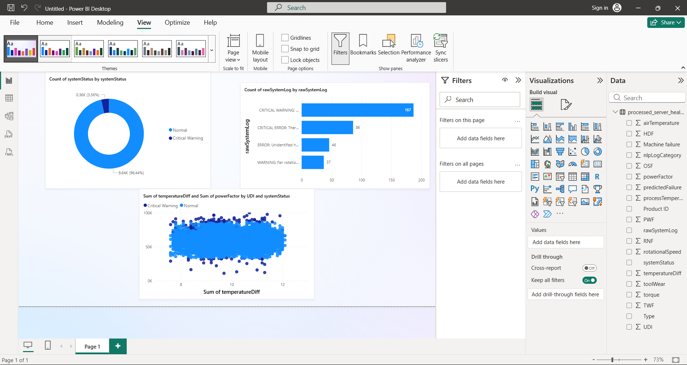

<div align="center">

# ⚡ IT Infrastructure Health Command Center

### Enterprise Predictive Maintenance Pipeline & BI Dashboard


<br/>

**Predict hardware failures early and reduce operational alert fatigue using ML + BI**

</div>

---

## 🔍 Overview

An **end-to-end predictive maintenance system** for enterprise IT infrastructure.

This project integrates:

* Machine Learning (XGBoost)
* Domain-driven feature engineering
* NLP-based log clustering
* REST API deployment
* Power BI visualization

to deliver **real-time, actionable failure predictions**.

---

## 📊 Dashboard Preview

<p align="center">
  
</p>

---

## ⚙️ Key Highlights

* End-to-end pipeline (data → ML → API → BI)
* Handles severe class imbalance (3.6% failures)
* Precision-optimized alert system (reduces false alarms)
* Domain-based feature engineering (thermal + mechanical)
* NLP clustering for root cause analysis
* Production-ready deployment using Docker

---

## 🏗 System Architecture

```bash
┌──────────────────────┐
│  Raw Telemetry Data  │
└──────────┬───────────┘
           ↓
┌──────────────────────┐
│ Feature Engineering  │
│ tempDiff, powerFactor│
└──────────┬───────────┘
           ↓
┌──────────────────────┐
│   XGBoost Model      │
│ Failure Prediction   │
└──────────┬───────────┘
           ↓
┌──────────────────────┐
│ Flask API (/predict) │
└──────────┬───────────┘
           ↓
┌──────────────────────┐
│ Processed Dataset    │
└──────────┬───────────┘
           ↓
┌──────────────────────┐
│ Power BI Dashboard   │
└──────────────────────┘
```

---

## 🧠 Machine Learning

### Approach

| Component          | Method                   |
| ------------------ | ------------------------ |
| Model              | XGBoost Classifier       |
| Imbalance Handling | `scale_pos_weight`       |
| Threshold          | 0.85 (precision-focused) |
| NLP                | TF-IDF + K-Means         |

---

### 📈 Performance

| Metric    | Value |
| --------- | ----- |
| Precision | 83%   |
| Recall    | 78%   |
| F1 Score  | 0.80  |

**Impact:**

* Detects ~80% of failures
* ~11 false alerts per 2000 systems

---

## ⚙️ Feature Engineering

* **temperatureDiff**
  → `processTemperature - airTemperature`

* **powerFactor**
  → `rotationalSpeed × torque`

---

## 🚀 Deployment

### 🐳 Docker

```bash
git clone https://github.com/yourusername/server-health-command-center.git
cd server-health-command-center

docker build -t server-health-api .
docker run -p 5000:5000 server-health-api
```

---

### 💻 Local Setup

```bash
pip install -r requirements.txt
python serverPipeline.py
```

---

## 📂 Project Structure

```bash
├── Data/
├── app.py
├── serverPipeline.py
├── Dockerfile
├── requirements.txt
├── IT_Infrastructure_Command_Center.pbix
```

---

## ⚠️ Dataset & Model

* The dataset (`ai4i2020.csv`) is not included in this repository
* Download it from Kaggle:
  👉 https://www.kaggle.com/datasets/stephanmatzka/predictive-maintenance-dataset-ai4i-2020

---

### 📥 Setup Instructions

1. Download the dataset from the above link
2. Place it inside:

```bash
Data/ai4i2020.csv
```

---

### 🤖 Model

* The trained model (`xgboost_model.joblib`) is not included
* Generate it by running:

```bash
python serverPipeline.py
```

---

### ⚠️ Why these files are excluded

* Keeps repository lightweight
* Avoids large file issues on GitHub
* Ensures reproducibility through pipeline execution

---

## 🎯 Business Impact

* Reduces alert fatigue in IT operations
* Enables proactive maintenance
* Improves system reliability
* Converts raw telemetry into actionable insights

---

## ⭐ Support

If you found this useful, consider giving it a star.
